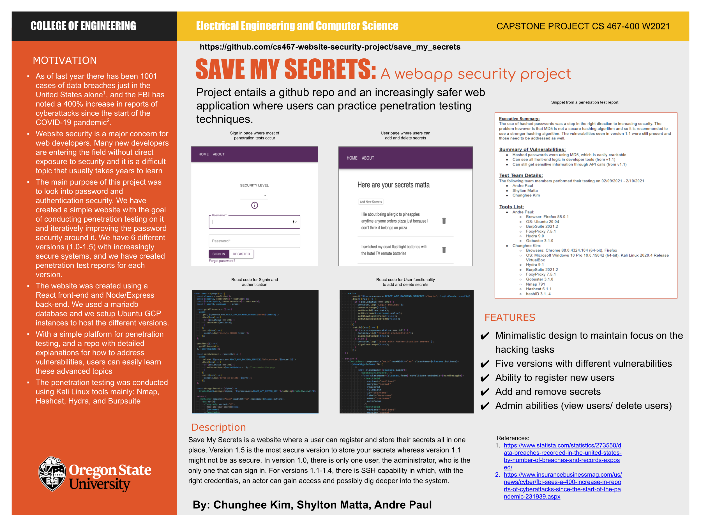

# Welcome to Save My Secrets

Save My Secrets is a single page application made with React and Node/Express to research the vulnerabilites around websites and around password safety. We will be incrementally securing the Save My Secrets web application with each release by performing a penetration test and creating a write-up for that specific version. We intend to use the tools in Kali linux and prevalent tools to gain and exploit passwords. Feel free to checkout our current live sites and play around in those environments. Happy Hacking!

## Instructions to run this app locally

(Note: you must have `node v.14.15.4+` and `mariadb v10.3.27+` on your system to run this project locally. The following instructions are for a `unix` based system.)

## Front end instructions

- Navigate to the `front-end` directory.
- Run `npm install`.
- Run `npm start`. The webapp should now be running on `localhost:3000`.

## Back end instructions

- Navigate to the `back-end` directory.
- Run `npm install`.
- Run `npm start`. The server should now be listening on `localhost:4000`.

## Database instructions

- Run `mariadb` to start its CLI tool in the `back-end` directory.
- Create a local database by running `CREATE DATABASE <DB_NAME>;`, where DB_NAME is your choice of name.
- Be sure that `<username>` has privileges on the database specified by `<DB_NAME>`. You can read more about granting privileges in the MariaDB documentation [here](https://mariadb.com/kb/en/grant/).
- Run `mariadb -u <username> -p <DB_NAME> < database/db.sql` to populate `<DB_NAME>` with mock data.
- Still in the `back-end` directory, create a file `config/default.json`. The contents should be as follows:

```
{
  "db": {
    "host": "localhost",
    "port": "<portNumber>",
    "username": "<username>",
    "password": "<password>",
    "databaseName": "<DB_NAME>",
    "connectionLimit": 10
  }
}
```

- Here, `<portNumber>` should be the port that your local database server is on. You can double check this by querying `SHOW GLOBAL VARIABLES LIKE 'PORT';` in the MariaDB CLI.

## Penetration Test Reports

- [v1.0](https://docs.google.com/document/d/1bHbGZlmDtVqcUrWsEjpkIG4kdxffRHM9C4MsS01IdAw/edit?usp=sharing)
- [v1.1](https://docs.google.com/document/d/1ba__xUNUEnI-te9-6eFxmma6F_FlkA8m427E3zd21UA/edit?usp=sharing)
- [v1.2](https://docs.google.com/document/d/1EQudqb8eeEMnyLfhe7GBZclVeWz1V37OdBJOj1rEmfU/edit?usp=sharing)
- [v1.3](https://docs.google.com/document/d/1JSFHFV5U_26cNBEl-aS5H_pXir9ZHqIxx5A323ZRoUo/edit?usp=sharing)
- [v1.4](https://docs.google.com/document/d/1B4bvayGP7xXw-2zXmcmic-cMcrJdVCukRN1oWao9TXs/edit?usp=sharing)
- [v1.5](https://docs.google.com/document/d/19Enf1h7AQGz8ty89MV98tErf02JOoNCTOlkgZo6ytOM/edit?usp=sharing)

## Save My Secrets Poster



## Save My Secrets Final Report

[Final Report](https://docs.google.com/document/d/1ypZ8GtlM5cC3wSdA8XUcVM5Fk_zF3z4oyV3ONPWxRd4/edit?usp=sharing)

## Note

- Due to time constraints we did not properly setup a web server to serve our React production code
- Production deployments were setup on Google Cloud Platform with Ubuntu VM instances during the spring term (01/20 - 03/20), but they are no longer available due to fiscal constraints and policy issues with Google.
